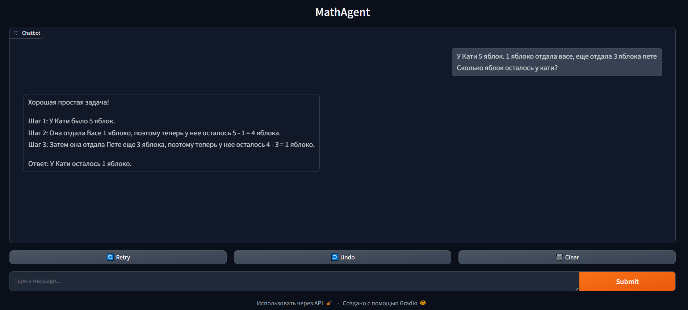
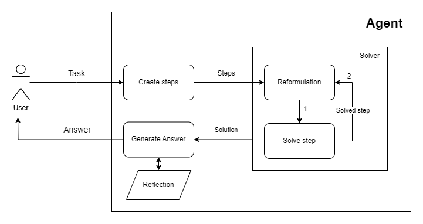

# Агент для решения математических задач

---
**Текущая реализация имеет вид**

Общение с агентом происходит через чат, реализованном при помощи библиотеки gradio. 

## Работа агента представлена на диаграмме:

